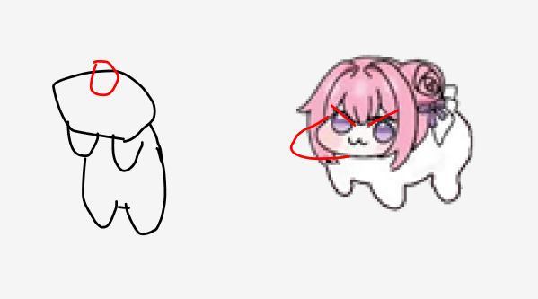

# Dororong Desktop Pet — Direct Interaction Design

- Status: approved for staged implementation
- Approved: 2026-08-31
- Target: Windows, C# / .NET 8 / WPF
- Extends: `docs/specs/2026-08-26-dororong-m1-design.md`
- Refines: Stage C of `docs/roadmaps/2026-08-28-dororong-m1-expression-animation-roadmap.md`

## 1. Authority and scope

This specification defines the first direct-manipulation extension for Dororong: a characterful short body click, a cat-like hanging body drag, and separately manipulable left and right cheeks. It records the approved interaction, presentation, art-production, delivery, and evidence boundaries so implementation does not have to reconstruct them from conversation history.

The base M1 design remains authoritative for the high-level behavior model, timing ownership, priority, Windows window behavior, non-interference, work-area bounds, process lifetime, and deferred scope. This document materially refines roadmap Stage C and adds cheek manipulation to its deliverables. It does **not** add a new high-level `PetState` and does not turn the presenter into a game engine.

The high-level state list remains:

`IDLE`, `WALK`, `CURIOUS`, `STARTLED`, `CLICK_REACTION`, `DRAGGED`, and `SLEEP`.

The existing behavior priority remains:

`DRAGGED > CLICK_REACTION > STARTLED > CURIOUS > SLEEP / IDLE / WALK`.

Direct interaction metadata temporarily takes visual and input-handling precedence over proximity presentation while a press is unresolved or a direct manipulation is active. This does not add another core behavior state or reorder the list above.

## 2. User reference and visual authority

The durable copy of the user-supplied sketch is:

- path: `docs/specs/assets/2026-08-31-dororong-direct-interaction-user-sketch.png`;
- SHA-256: `57F9FE39B0E96991DCDE2947F63E03FCBFBC81C950875216E7B81139BC0EC72C`.

The sketch expresses **silhouette and interaction intent**: the first figure shows the long, scruff-held hanging body shape; the second marks the cheeks as independent pull targets. It is not an executable instruction, pixel-accurate asset, anatomy authority, or permission to preserve its rough guide marks in production art.

The approved canonical and current accepted Dororong assets remain the identity authority. Outside the deformation required by the active interaction, every authored frame preserves the same head, face placement, hair, rose, bow, ribbons, body identity, no-tail interpretation, proportions, outline character, and transparent-background behavior.

## 3. Direct-interaction contract

### 3.1 Press target and lifetime

Primary pointer-down on an interactive character pixel classifies exactly one press target:

- `Body`;
- `LeftCheek`;
- `RightCheek`.

The target is classified once from the visible frame active at pointer-down and is locked until release or cancellation. Moving across another cheek or the body does not change the target. A cheek press can never become a body click or body drag during the same press; a body press can never become a cheek manipulation.

`LeftCheek` and `RightCheek` identify Dororong's anatomical cheeks in the canonical, unmirrored asset. The presenter maps those identifiers to the currently visible side after facing or mirroring so the cheek under the pointer remains the locked cheek throughout the interaction.

Only visible, alpha-hit-tested character pixels are eligible for target classification. Transparent pixels remain click-through to the application underneath.

### 3.2 Shared direct-manipulation rules

- Pointer-down on any valid target resets the inactivity timer.
- A valid direct manipulation wakes `SLEEP` immediately using the existing wake behavior boundary; it does not wait for release.
- While a press is pending or direct manipulation is active, new `CURIOUS` and `STARTLED` triggers are suppressed.
- Direct manipulation does not steal keyboard focus from the user's active work application.
- Pointer capture is released on normal release, cancellation, shutdown, or failure cleanup.
- Character/window positioning remains clamped to the primary work area under the existing M1 rule.
- Right-click remains reserved for the context menu and explicit Exit action.

After a cheek interaction ends, behavior resolves through the existing state model without emitting `CLICK_REACTION`. A cheek press that wakes `SLEEP` resolves to the ordinary wakeful baseline after its local release animation; it is not reclassified as a proximity response.

### 3.3 Body short click

A body press remains a pending click while pointer movement stays below the Windows system drag threshold. Dororong may show only a very subtle press squash during this pending interval. It must not show the stretched hanging silhouette before the threshold is crossed.

Release below the threshold confirms the existing `CLICK_REACTION`. The target visual lasts roughly 0.5 seconds and reads as a playful response rather than fear:

1. about 80 ms: subtle press/squash;
2. about 150 ms: short upward hop;
3. about 100 ms: brief airborne apex using the unchanged accepted body silhouette;
4. about 170 ms: descent, land/compress, and recovery to the canonical resting pose.

An awake body click keeps the exact canonical open-eye expression for the entire press, hop, apex, land, and recovery. It must not substitute the half-closed blink/squint frame or reuse the surprised expression or retreat language of `STARTLED`. A click that begins in `SLEEP` may first use the separately accepted sleep-wake transition frames, but uses the canonical open-eye artwork once the hop begins. The short body click does not introduce a newly drawn body or leg pose: the accepted canonical character artwork is transformed as a whole. A separate four-leg dangling drawing is deferred until a complete identity-preserving authored pose is approved.

If the user holds the press without crossing the threshold, the pending press pose may hold without advancing the confirmed click timeline. Release begins or continues the authored click reaction from a visually compatible press frame, without a one-frame reset to the canonical pose.

### 3.4 Body drag

Crossing the Windows system drag threshold during a locked `Body` press enters the existing `DRAGGED` state. No hanging or stretched pose appears before this threshold.

The entry motion progresses from the current canonical or pending-press frame into the cat/scruff-like silhouette expressed by the first figure in the user sketch:

- the head/top stays visually near the original grab anchor;
- the torso extends downward;
- the legs hang downward with readable, stable separation;
- the character remains recognizably the same Dororong rather than becoming a new long-bodied design.

The existing grab offset is preserved when the threshold is crossed, so neither the window nor the grab point jumps to the pointer. During drag, the character follows the pointer responsively, remains within work-area constraints, and does not switch into cheek manipulation.

Release ends capture and plays a short local settle/landing motion before returning to the existing wakeful baseline. The settle is presentation-local and does not create another core state. It does not have to reverse every entry frame if a separately authored release sequence reads more naturally.

### 3.5 Cheek press and pull

Both cheeks are independently supported. A locked cheek press never moves the Dororong window.

Press and negligible travel produce a local cheek press: only the selected cheek compresses slightly, then returns with a short elastic response on release. This does not trigger the body `CLICK_REACTION`.

Movement away from the press origin turns the same locked interaction into a cheek pull:

- outward horizontal movement is the primary deformation axis;
- inward horizontal movement remains a press/compression and never pulls the cheek through the face;
- vertical movement is damped and affects only pull strength and a small face tilt in v1;
- v1 does not produce large diagonal cheek distortion;
- effective pull distance is clamped at approximately 20 device-independent pixels (DIPs);
- release springs back to the canonical face in approximately 220 ms.

The pull captures the pointer so the same cheek remains controlled if the pointer leaves the character. Capture does not authorize window movement. The opposite cheek, hair, rose, bow, ribbons, body, and unmanipulated facial features remain stable apart from a deliberately authored small whole-face response.

## 4. Data and architecture

### 4.1 Separate direct-interaction metadata

The existing `PetState` enum and core state timing/priority remain intact. Direct interaction is represented by a small, explicit metadata record at the app/presentation boundary rather than new `CHEEK_PRESSED` or `CHEEK_PULLED` states.

The metadata needs only the information required to render and finish the active manipulation, such as:

- locked press target or none;
- press origin and current pointer position in one consistent coordinate space;
- whether the Windows drag threshold has been crossed;
- normalized press, pull, entry, or release progress;
- the selected anatomical cheek;
- capture/release/cancellation status.

This record does not choose autonomous behavior and does not duplicate the behavior core. Core events remain responsible for confirmed body click, `DRAGGED` entry/release, sleep wake, inactivity reset, and existing priority rules. The app owns Windows pointer capture, system drag thresholds, DPI/coordinate conversion, alpha hit testing, and no-activation mechanics. The presenter maps the combined core snapshot and direct-interaction metadata to an approved frame family and local transforms.

### 4.2 Visible-frame descriptor

Each visible-frame descriptor may supply optional canonical-space interaction metadata:

- left-cheek anchor and bounded hit region;
- right-cheek anchor and bounded hit region;
- a body hit region or body fallback after cheek regions;
- facing/mirroring transform information.

Cheek regions are evaluated before the body fallback, but only inside pixels that pass the frame's native alpha hit test. The descriptor maps anatomical anchors through the same arrangement, scale, translation, and mirroring used to display the frame. Hit regions must track the currently visible face during state animation rather than assuming one fixed window coordinate.

This is a small extension of the existing presenter contract. It is not a general skeleton, mesh, scene graph, animation graph, or plugin framework.

### 4.3 Input resolution

The input sequence is resolved in this order:

1. alpha hit test the visible frame;
2. classify and lock `LeftCheek`, `RightCheek`, or `Body` on pointer-down;
3. reset inactivity, wake if sleeping, capture when required, and suppress proximity reactions;
4. for `Body`, compare displacement with the current Windows system drag threshold;
5. for a cheek, calculate clamped/damped local pull metadata without moving the window;
6. on release, emit only the result allowed by the locked target;
7. release capture, run the local release presentation, and restore ordinary proximity eligibility.

Threshold comparison uses the operating system's current drag metrics in the same effective coordinate space as the pointer delta; it is not replaced by an unrelated hard-coded distance.

## 5. Visual and frame-production contract

### 5.1 Full-character authored frames

Every key image is a complete 96x96 character asset with transparency. Face-piece, eye-only, cheek-only, or body-only overlays are not production frames. The exact canonical head, hair, rose, bow, ribbons, approved outline, no-tail identity, and non-target anatomy are preserved outside the intended deformation.

The body-click slice is an explicit exception to authored key-image production. It reuses the exact accepted canonical open-eye character asset and produces the press, hop, apex, land, and recovery read with whole-character scale and translation only. It does not erase, redraw, replace, or procedurally synthesize the body or legs. Body-drag and cheek deformation still require complete approved character images under the rules below.

The rough user sketch is used as the silhouette basis for the body-hang family and as the interaction-location basis for the cheeks. It does not replace the canonical asset as the character-identity source.

### 5.2 Coherent sequential authoring

Smoothness comes from coherent shape progression, not frame count alone. Key images are authored sequentially with onion-skin comparison against their immediate neighbors. They must not be independently generated and then placed in chronological order. Between adjacent images:

- head scale and anchor move continuously;
- hair, rose, bow, and ribbon geometry do not jump or redraw themselves;
- legs remain countable and change pose along a readable path;
- body mass does not alternate left/right or expand/contract without motion intent;
- face placement and expression progress continuously;
- the silhouette contains no one-frame protrusion, extra limb, missing contour, tail, internal smear, or alpha fringe.

Additional key images are added only when they close an observed pose or timing discontinuity. A larger family that changes anatomy independently is a failure even if playback has more frames.

### 5.3 Initial acceptance-driven frame ranges

The initial production targets are ranges, not immutable quotas:

- body click: no new body-pose images; sample the accepted character asset continuously through press, lift, apex, descent, land, and recovery transforms;
- body drag entry: roughly 6–8 authored key images from canonical/pending press to the full hanging pose;
- body drag release/settle: roughly 4–6 authored key images;
- cheek interaction, per side: roughly 5–7 authored key images from press through half and full pull;
- cheek release spring, per side: roughly 4–6 authored key images.

Reversing or reusing frames is allowed only when normal-speed playback remains visually coherent. The family may use more or fewer images when direct comparison shows that doing so improves continuity without adding anatomy noise.

### 5.4 Runtime interpolation

Runtime may interpolate between adjacent approved key images at a nominal 16 ms presentation cadence. For the body-click exception, runtime samples continuous whole-character scale and translation transforms at that cadence while the accepted source image remains unchanged. Interpolation is composed into one premultiplied `Pbgra` surface per displayed frame when image families are involved. It must not reduce the opacity of the entire character or stack partially transparent WPF character controls in a way that creates an alpha dip, washed-out silhouette, or double-image ghost.

Interpolation is a timing bridge between already coherent neighbors; it is not a substitute for an authored missing pose. If adjacent frames have materially different anatomy, anchor, or scale, the art family must be corrected before integration.

### 5.5 Candidate review package

Before any authored family is integrated into product assets, it is shown as:

1. all native 96x96 frames in sequence;
2. a nearest-neighbor enlarged strip on a contrasting background;
3. normal-speed playback with production-intent timing.

The root worker performs the visual check first. A candidate with a visible identity, anatomy, anchor, opacity, or timing defect is corrected before it is shown to the user. User approval of that exact candidate family is required before product integration. Approval of one family does not approve the later families.

For the transform-only body click, the equivalent package is a native-scale rendered timeline, a nearest-neighbor enlarged timeline, and normal-speed playback produced from the exact accepted source image and transform sampler. No body-click art asset is promoted.

## 6. Motion timelines

### 6.1 Body click timeline

The initial target is approximately 500 ms after click confirmation:

| Phase | Target duration | Required read |
|---|---:|---|
| press/squash | ~80 ms | subtle compression; no fear expression |
| lift | ~150 ms | clear upward impulse without head/body separation |
| apex | ~100 ms | unchanged accepted body silhouette and canonical open-eye expression are visibly airborne |
| descent/land/recover | ~170 ms | readable contact, one small compression, canonical rest |

Timing can be calibrated during actual Windows observation, but it must preserve the four-part read and remain distinct from `STARTLED`.

### 6.2 Body drag timeline

Threshold crossing begins the authored 6–8-frame entry to full hang. The entry should be quick enough that drag feels attached to the pointer, while still showing a readable stretch progression. Pointer/window response must not wait for the visual entry to finish.

Full hang holds while dragging. Release begins the 4–6-frame settle immediately and returns locally to the canonical wakeful pose. The settle cannot move the window away from its released, work-area-clamped position.

### 6.3 Cheek timeline

Cheek strength maps continuously across the approved press, half-pull, and full-pull keys, clamped near 20 DIPs. The image family follows pointer movement without skipping backward and forward between keys at a boundary.

Release starts from the currently displayed deformation and returns over approximately 220 ms using the approved spring family. The release may include one restrained overshoot, but it must not swap cheeks, move the window, alter unrelated anatomy, or trigger the body click animation.

## 7. Delivery order and checkpoints

Work proceeds in small, user-observable slices:

1. **Attempt-38 sleep crossfade checkpoint.** Preserve the current sleep-crossfade work separately before direct-interaction implementation. The user described its result as `나쁘지 않다`; that statement must not be inflated into proof that the work is committed, that all Stage A routes pass, or that broader M1 is complete.
2. **Input target metadata and tests.** Add locked `Body`/`LeftCheek`/`RightCheek` classification, visible-frame anchors, capture/cancellation behavior, and deterministic input tests without yet integrating unapproved interaction art.
3. **Body click.** Preserve the exact accepted character artwork, implement the transform-only press/hop/land timeline, perform root visual review on rendered output, then run body-click actual-Windows acceptance. Rejected procedural/generated body-pose candidates remain evidence only and are never product assets.
4. **Body drag.** Produce and approve entry/hang/release art, integrate threshold and presentation behavior, then verify grab offset, bounds, and release on Windows.
5. **Cheeks.** Produce and approve left and right cheek families, integrate press/pull/release, then verify both sides and window immobility on Windows.
6. **Final non-interference.** Recheck transparent click-through, alpha hit regions across animation frames, no focus theft, topmost behavior, work-area bounds, capture cleanup, and explicit Exit.

Only one small, visibly judgeable interaction group is presented to the user at a time. Later slices do not begin merely because earlier source code compiles.

## 8. Atomic acceptance and evidence boundaries

### 8.1 Automated interaction checks

Automated checks cover, at minimum:

- a body release below the current Windows drag threshold emits one `CLICK_REACTION`;
- crossing the threshold emits `DRAGGED` and never emits the click result;
- no hanging pose or drag result occurs before threshold crossing;
- threshold crossing preserves the original grab offset;
- pointer-down target is locked through release and cancellation;
- left and right cheek regions both classify correctly under normal and mirrored facing;
- cheek press/pull never moves the window or emits body click/drag;
- inward, outward, vertical-damped, and maximum-distance calculations obey the cheek contract;
- cheek release starts from current strength and returns within the release boundary;
- body and cheek interactions wake `SLEEP`, reset inactivity, and suppress proximity triggers while active;
- capture is always released on release, cancellation, shutdown, and failure cleanup;
- work-area clamping and existing state priority tests remain passing.

Passing these checks proves deterministic classification and calculation only. It does not prove visible quality, cross-process click-through, focus preservation, or actual Windows acceptance.

### 8.2 Asset and rendered-motion checks

Each exact approved art family must prove:

- 96x96 complete-character dimensions and valid premultiplied-alpha preparation;
- expected frame identity and ordering;
- exact preservation of protected character regions outside intended deformation;
- no tail, extra/missing limb, broken outline, internal stain, transparent RGB fringe, or unintended face/hair/ornament change;
- neighbor-to-neighbor anchor, scale, silhouette, and anatomy continuity;
- 16 ms playback with no whole-character alpha dip, double-image ghost, or one-frame anatomy jump;
- readable motion at normal speed, not only in a slowed strip.

Repository image analysis and rendered playback can reject a candidate. They cannot promote an unobserved user-facing interaction to actual-Windows `PASS`.

The transform-only body click instead proves that every awake sampled frame uses the exact accepted canonical open-eye source image, keeps opacity at 1, changes only the permitted whole-character transforms, preserves one visible character surface, leaves the window position unchanged, and returns exactly to the canonical rest transform. A sleep-origin click may use only the accepted sleep-wake bridge before the canonical hop. Rendered normal-speed playback must show no float-like drift, stepped movement, clipping, expression substitution, or anatomy substitution.

### 8.3 Actual Windows acceptance

Actual Windows observation is recorded separately for each delivery slice:

1. body press below threshold stays un-stretched, retains the canonical open-eye expression while awake, and releases into the distinct playful click animation;
2. body movement beyond threshold enters hang without grab-point or window jump;
3. dragged movement remains responsive and bounded, and release settles at the released location;
4. left-cheek press/pull/release works and does not move the window;
5. right-cheek press/pull/release works and does not move the window;
6. cheek clamp and approximately 220 ms spring feel controlled rather than torn or snapped;
7. direct interaction wakes sleep and prevents `CURIOUS`/`STARTLED` from interrupting it;
8. transparent pixels still pass clicks to a known control behind Dororong during canonical, click, hanging, cheek, and release frames;
9. body and cheek interaction do not steal keyboard focus from the active work application;
10. capture cleanup, work-area bounds, topmost presentation, and explicit Exit still behave correctly.

Each item remains `UNVERIFIED` until directly observed on the current Windows product artifact. Build success, tests, process liveness, image hashes, captured frame sequences, or automation failure do not substitute for user observation and cannot promote acceptance.

### 8.4 Evidence identity

Every acceptance attempt records the exact source checkpoint, publish path, executable and relevant asset hashes, test/build result, observation target, and user-reported outcome. A later candidate or rebuilt executable does not inherit an earlier user's acceptance unless exact identity and the relevant behavior boundary are established.

## 9. Non-goals and risks

### Non-goals

This extension does not add feeding, affection, progression, experience, sound, accounts, cloud storage, AI conversation, external services, auto-start, a large settings screen, multiple characters, polished multi-monitor support, a general physics system, skeletal animation, or a general game/animation engine.

Cheek pulling is a bounded local character interaction, not a reusable facial-deformation editor. Body hanging and release settling remain presentation for the existing `DRAGGED` state, not new behavior states.

### Risks and required handling

- **More frames can create more noise.** Independent redraws cause anatomy and anchor jumps. Author each next frame from its neighbor with onion-skin comparison; reject the family when continuity fails.
- **Interpolation can hide neither bad anatomy nor bad anchors.** Correct the adjacent key images rather than stretching the blend duration.
- **Transparent crossfade can wash out the character.** Compose onto one premultiplied surface and verify opacity across every 16 ms sample.
- **Cheek hit regions can steal body input.** Keep them bounded to the visible cheek, apply alpha hit testing first, and test both canonical and mirrored mappings.
- **Captured cheek input can accidentally move the window.** Keep cheek displacement presentation-local and test window coordinates throughout press, pull, and release.
- **DPI conversion can change click-versus-drag behavior.** Use current Windows system metrics and one consistent effective coordinate space.
- **Direct manipulation can regress non-interference.** Recheck transparent click-through and keyboard focus on the actual Windows artifact after each integrated interaction family.
- **A visually attractive frame can drift from Dororong identity.** Canonical identity and exact protected regions outrank novelty; user approval is family-specific and precedes integration.

## 10. Completion boundary

This specification is complete when it durably records the approved direct-interaction design. Its existence does not mean attempt 38 is checkpointed, art is approved, code is implemented, automated checks pass, or Windows acceptance is complete.

The direct-interaction extension is complete only after all three interaction families are approved and integrated, every automated and rendered-motion contract passes for the exact product checkpoint, and every required actual-Windows observation in section 8.3 is recorded as `PASS`. Until then, the relevant slice and broader M1 remain `PARTIAL` or `UNVERIFIED` according to their existing evidence.
